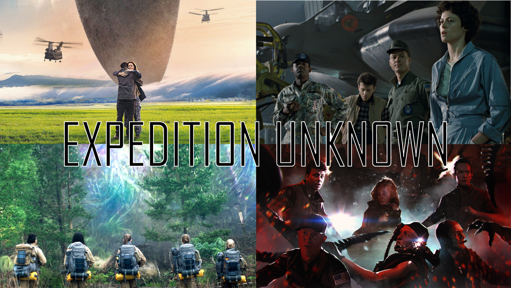

# Expedition Unknown - TRPG 
A tabletop Role-playing game puts you in the shoes of scientists or scholars on an expedition into the unknown while being escorted and protected by military or the kingsguards.

For this rule guide, a contemperary sci-fi setting will be used as basis, but it can easily be changed to match any other settings.

## Character creation

### Stats
There are 5 stats that are used to describe the overall strength and weakness of a character:

- Expertise (Ex) - _How well you can exert your expertise, lower means greater risk of mistakes_
- Stress (St) - _How well you can work under pressure and extreme situations_
- Able (Ab) - _How well you can handle yourself, lower means higher reliance on others_
- Social (So) - _How well you interact with others, higher means better chance of giving orders, etc_
- Motivation (Mo) - _How motivated you are at being on the expedition and how you perform over longer time spans_

Every stat can have a value of 1-5. When a skill check is done, you will roll a 1d6 against your stat and will have to roll equal or lower than your stat value. (Stat of 3 -> 1, 2, 3 = success). This means that rolling a value of 6 is always a failed dice. When you have advantage, you roll and extra dice and choose the lowest. If you have disadvantage you roll an extra dice and choose the highest. You may have multiple disadvantages and advantages at the same time. They are then summed together (1 - 3 = -2 = disadvantage) and becomes a single advantage/disadvantage or they all cancel each other out.

To determine your stats you go through all of them one by one and roll d20 two times. For each dice, a value of 1-5 gives you a -1 stat trait, 6-15 a 0 stat trait, 16-20 a +1 stat trait. Summarize all traits for each stat and add their sum to 3 which is the base value of every stat. A stat can ONLY be between 1-5, regardless if the sum of the traits exceeds that range.

*Example:*

- Stat = 3 (base) + 0 (first dice rolled 11) + -1 (second dice rolled 3) = 2

### Traits
A trait is coupled directly to a certain stat. A negative trait (-1) is something that affects your character stat negatively in general, but may add advantage/disadvantage in certain situations. A neutral trait (0) will not affect the stat but may add advantage/disadvantage in certain situations. A positive trait (+1) affects the stat positivly in general but may add advantage/disadvantage in certain situaions. Traits can be gained and lost during the game, there is no maximum to the number of traits a player can have.

*Example:*

- Stress = 3 (base) + -1 (first dice rolled 2 -> "Scaredy cat") + 1 (second dice rolled 17 -> "Yoga instructor") = 3

### Choosing traits
Traits can either be chosen using a predetermined table, or the player can make them up freely as long as they match the negative / neutral / positive aspect. If the tables does not match the campaign setting (e.g. a fantasy expedition into forgotten ruins), feel free to come up with your own tables!

_DISCLAIMER_

Assigning a trait as a negative stat reducing trait may be perceived as a judgement of real people having this trait in real life. The traits are only intended to give your character a fast backstory and description and also given them an extra gameplay dynamic. It is by no means a statement against anyone to be perceived as lesser. So if you do not accept how a predetermined trait table has been setup, feel free to change around however you like, swap or replace any traits you disagree with or are uncomfortable with.

_WORK IN PROGRESS, NOT FINAL_

<table>
  <thead>
    <tr>
      <th colspan="2">Roll d20</th>
      <th colspan="2">Expertise</th>
      <th colspan="2">Stress</th>
      <th colspan="2">Able</th>
      <th colspan="2">Social</th>
      <th colspan="2">Motivation</th>
    </tr>
    <tr>
      <th>Value</th>
      <th>Stat effect</th>
      <th>A</th>
      <th>B</th>
      <th>A</th>
      <th>B</th>
      <th>A</th>
      <th>B</th>
      <th>A</th>
      <th>B</th>
      <th>A</th>
      <th>B</th>
    </tr>
  </thead>
  <tbody>
    <tr>
      <th>1</th>    
      <th>-1</th>    
      <th>Scatter brain</th>    
      <th>Impaired memory</th>    
      <th>Panic attacks</th>    
      <th>Burned out</th>    
      <th>Old age</th>    
      <th>Addiction</th>    
      <th>Lone wolf</th>    
      <th>Highly arrogant</th>    
      <th>Forced to join</th>    
      <th>Terminally ill family</th>    
    </tr>
    <tr>
      <th>2</th>    
      <th>-1</th>    
      <th>Very sloppy</th>    
      <th>Short attention span</th>    
      <th>Scaredy cat</th>    
      <th>Traumatic experience</th>    
      <th>Sickness</th>    
      <th>Wheelchair</th>    
      <th>Racist</th>    
      <th>Sexist</th>    
      <th>Removed from personal work</th>    
      <th>Thinks expedition is fatal</th>    
    </tr>
    <tr>
      <th>3</th>    
      <th>-1</th>    
      <th>Guessing a lot</th>    
      <th>Shady merits</th>    
      <th>Pessimitic</th>    
      <th>Nervous</th>    
      <th>Blind</th>    
      <th>Deaf</th>    
      <th>Narcissist</th>    
      <th>Cruel</th>    
      <th>Depressed</th>    
      <th>Do not trust goverment</th>    
    </tr>
    <tr>
      <th>4</th>    
      <th>-1</th>    
      <th>Impulsive</th>    
      <th>Careless</th>    
      <th>Caves under pressure</th>    
      <th>Fight or flight</th>    
      <th>Obese</th>    
      <th>Missing limb</th>    
      <th>Bad temper</th>    
      <th>Dishonest</th>    
      <th>Not rewarding enough</th>    
      <th>Have done enough service</th>    
    </tr>
    <tr>
      <th>5</th>    
      <th>-1</th>    
      <th>Lack of experience</th>    
      <th>Idea fixation</th>    
      <th>Breakdowns</th>    
      <th>Tremors</th>    
      <th>Very clumsy</th>    
      <th>Poor physical form</th>    
      <th>Nasty</th>    
      <th>Rude</th>    
      <th>Expecting child</th>    
      <th>Bad previous expeditions</th>    
    </tr>
    <tr>
      <th>6</th>    
      <th>0</th>    
      <th>Meticulous</th>    
      <th>Broad knowledge</th>    
      <th>Meditates</th>    
      <th>Finger taps</th>    
      <th>Old injury</th>    
      <th>Surfer</th>    
      <th>Poker face</th>    
      <th>Small talker</th>    
      <th>Career climbing</th>    
      <th>Hefty payment</th>    
    </tr>
    <tr>
      <th>7</th>    
      <th>0</th>    
      <th>E.7A</th>    
      <th>E.7B</th>    
      <th>S.7A</th>    
      <th>S.7B</th>    
      <th>A.7A</th>    
      <th>A.7B</th>    
      <th>O.7A</th>    
      <th>O.7B</th>    
      <th>M.7A</th>    
      <th>M.7B</th>    
    </tr>
    <tr>
      <th>8</th>    
      <th>0</th>    
      <th>E.8A</th>    
      <th>E.8B</th>    
      <th>S.8A</th>    
      <th>S.8B</th>    
      <th>A.8A</th>    
      <th>A.8B</th>    
      <th>O.8A</th>    
      <th>O.8B</th>    
      <th>M.8A</th>    
      <th>M.8B</th>    
    </tr>
    <tr>
      <th>9</th>    
      <th>0</th>    
      <th>E.9A</th>    
      <th>E.9B</th>    
      <th>S.9A</th>    
      <th>S.9B</th>    
      <th>A.9A</th>    
      <th>A.9B</th>    
      <th>O.9A</th>    
      <th>O.9B</th>    
      <th>M.9A</th>    
      <th>M.9B</th>    
    </tr>
    <tr>
      <th>10</th>    
      <th>0</th>    
      <th>E.10A</th>    
      <th>E.10B</th>    
      <th>S.10A</th>    
      <th>S.10B</th>    
      <th>A.10A</th>    
      <th>A.10B</th>    
      <th>O.10A</th>    
      <th>O.10B</th>    
      <th>M.10A</th>    
      <th>M.10B</th>    
    </tr>
    <tr>
      <th>11</th>    
      <th>0</th>    
      <th>E.11A</th>    
      <th>E.11B</th>    
      <th>S.11A</th>    
      <th>S.11B</th>    
      <th>A.11A</th>    
      <th>A.11B</th>    
      <th>O.11A</th>    
      <th>O.11B</th>    
      <th>M.11A</th>    
      <th>M.11B</th>    
    </tr>
    <tr>
      <th>12</th>    
      <th>0</th>    
      <th>E.12A</th>    
      <th>E.12B</th>    
      <th>S.12A</th>    
      <th>S.12B</th>    
      <th>A.12A</th>    
      <th>A.12B</th>    
      <th>O.12A</th>    
      <th>O.12B</th>    
      <th>M.12A</th>    
      <th>M.12B</th>    
    </tr>
    <tr>
      <th>13</th>    
      <th>0</th>    
      <th>E.13A</th>    
      <th>E.13B</th>    
      <th>S.13A</th>    
      <th>S.13B</th>    
      <th>A.13A</th>    
      <th>A.13B</th>    
      <th>O.13A</th>    
      <th>O.13B</th>    
      <th>M.13A</th>    
      <th>M.13B</th>    
    </tr>
    <tr>
      <th>14</th>    
      <th>0</th>    
      <th>E.14A</th>    
      <th>E.14B</th>    
      <th>S.14A</th>    
      <th>S.14B</th>    
      <th>A.14A</th>    
      <th>A.14B</th>    
      <th>O.14A</th>    
      <th>O.14B</th>    
      <th>M.14A</th>    
      <th>M.14B</th>    
    </tr>
    <tr>
      <th>15</th>    
      <th>0</th>    
      <th>E.15A</th>    
      <th>E.15B</th>    
      <th>S.15A</th>    
      <th>S.15B</th>    
      <th>A.15A</th>    
      <th>A.15B</th>    
      <th>O.15A</th>    
      <th>O.15B</th>    
      <th>M.15A</th>    
      <th>M.15B</th>    
    </tr>
    <tr>
      <th>16</th>    
      <th>+1</th>    
      <th>E.16A</th>    
      <th>E.16B</th>    
      <th>S.16A</th>    
      <th>S.16B</th>    
      <th>A.16A</th>    
      <th>A.16B</th>    
      <th>O.16A</th>    
      <th>O.16B</th>    
      <th>M.16A</th>    
      <th>M.16B</th>    
    </tr>
    <tr>
      <th>17</th>    
      <th>+1</th>    
      <th>E.17A</th>    
      <th>E.17B</th>    
      <th>Yoga instructor</th>    
      <th>S.17B</th>    
      <th>A.17A</th>    
      <th>A.17B</th>    
      <th>O.17A</th>    
      <th>O.17B</th>    
      <th>M.17A</th>    
      <th>M.17B</th>    
    </tr>
    <tr>
      <th>18</th>    
      <th>+1</th>    
      <th>High performance job</th>    
      <th>Jack of all trades</th>    
      <th>S.18A</th>    
      <th>S.18B</th>    
      <th>A.18A</th>    
      <th>A.18B</th>    
      <th>O.18A</th>    
      <th>O.18B</th>    
      <th>M.18A</th>    
      <th>M.18B</th>    
    </tr>
    <tr>
      <th>19</th>    
      <th>+1</th>    
      <th>Outside-the-box thinking</th>    
      <th>Highly efficient</th>    
      <th>Dandelion kid</th>    
      <th>War veteran</th>    
      <th>Military trained</th>    
      <th>Expedition experience</th>    
      <th>World famous</th>    
      <th>Charismatic</th>    
      <th>Childhood dream</th>    
      <th>Adventurous</th>    
    </tr>
    <tr>
      <th>20</th>    
      <th>+1</th>    
      <th>Innovator</th>    
      <th>Leading expert</th>    
      <th>Tough psyche</th>    
      <th>Disaster experience</th>    
      <th>Mountaineer</th>    
      <th>Olympic athlete</th>    
      <th>Persuasive</th>    
      <th>Great rhetorician</th>    
      <th>Saving humanity</th>    
      <th>First to set foot</th>    
    </tr>
  </tbody>
</table>

### Choosing specialization
A character specialization is the reason why they have been selected as a candidate and is their unique expertise that they bring to the expedition. This can be used to give advantage on skill checks but could also enable actions that would require a dedicated team and more time to do. A player may roll for a random specialization or choose freely. 

| 1-2 | 3-4 | 5-6 | 7-8 |
| --- | --- | --- | --- |
| 1. Systems analyst | 3. X | 5. X | 7. X |
| 2. Chemist | 4. X | 6. X | 8. X |

### Clearance
A characters clearance indicates how valuable and trusted they are for the success of the expedition. Higher clearance gives higher authority and will help you set your own agenda. A character starts at level E and may be promoted and demoted throughout the game. Any given clearance also have all the authority given from the lower levels. Everyone in the expedition has a clearance assigned to them and chain of command applies, meaning a clearance can order lower clearance, but can not order equal or higher clearance. All military are of clearance D or higher, but can be demoted to lower clearance.

| Level | Authority | Escorts
| --- | --- | --- |
| S | Supreme commander of the expedition. There is only one of this rank at any given time. Complete single authority over the entire expedition. | - |
| A | Full access to all classified information. In charge of the expedition together with the commander and other A's. | - |
| B | Access to most classified information. Can order promotions/demotions up to same clearance and new outposts to be established. | - |
| C | Access to some classified information. Can see expedition inventory list and may request from it. | - |
| D | May move around freely within all areas | 3 soldiers, 1 assistant with 2 soldiers  |
| E | May move around freely within secured areas. Can join exploration of unsecured areas as an assistant to another team. | 2 soldiers |
| F | Stationed on a base or an outpost and can not leave. No authority at all. | No escort |

### Assigned escort
A character can have escorts assigned to them in form of military and civilians. An assigned escort has a clearance and a specialization. The number of military and civilians escorts is determined by the characters clearance. The military will be very capable and diverse in their abilities. A military mechanic might know every nuts and bolts for a vehicle by heart, but you are the ones who DESIGNED every nuts and bolt of the vehicle! And that is why your expertise is needed, no one else can match you for it.

#### Commands and persuasion
While orders can always be made when the player out ranks someone, commands are different and requires persuading the other person. They player has to make an argument and will then have to roll either a social check or an expertise check depending on which the argument is based on. The GM decides which stat check to be performed. Advantage and disadvantage is also up for the GM discretion to use. A strong solid argument in itself might yield an advantage, and a weak one might give a disadvantage. For example "We must do this, trust me!" could be a weak argument with disadvantage since the escorts have not gained any trust yet for the player. However, given that the GM sees this as a social check, and the player has a strong charismatic social trait, the GM gives that an advantage. The total advantage is -1 + +1 = 0, so the player makes a normal social check.

#### Resolving actions made by escorts
If GM thinks a check needs to be done by the escorts, same rules applies as for the players. An escorting solider will always have a disadvantage on expertise rolls, so if they need to do something that requires expertise, you better make sure they get all the help they can get.

| Stat | Soldier | Assistant |
| --- | --- | --- |
| Expertise | 1 (with disadvantage) | 2 |
| Able | 5 | 3 |
| Stress | 5 | 2 |
| Social | 3 | 3 |
| Motivation | 4 | 3 |

*Example:*

You come to an collapsed tunnel and command your escorting soldiers to clear it out. If only one soldiers does it, the GM rolls an able check. If two soldiers does it, GM rolls an able check with advantage.

### Statuses
Compared to traits, statuses are temporary effects that impacts the characters. See following table for list of statuses. GM is free to add any extra statuses.

| Status | Effect | Duration |
| --- | --- | --- |
| High / Low morale | All skill checks adds -1 / +1 to dice results (still being a valid dice value) | Until next morale check or an expedition break-through or setback |
| Panic | Character will only think about getting to safety. Disadvantage on all rolls | Until calmed down, do a stress check when in safety, if pass calm down, if fail calm down after a longer period if remained in safety |
| Incapacitated | Cannot perform any actions at all | Until revived, either by themselves or from others |

## Expertise Challenges
During the expedition, some actions will result in a stat check per GMs discretion. Some actions however till trigger a expertise challenge instead. The player will then be given a puzzle to solve. They may not share this puzzle unless other players are nearby to help out, or if the puzzle is transported to an outpost for deciphering. A player can only look at the actual puzzle if they are nearby it, if they drop it or leave it, they may no longer look at the puzzle. A player might find some interesting information will out in the field. The challenge is too complex to be solved on the spot, so the puzzle is collected into a computer and the group goes back to the main camp to research it further. However, the road back maybe is not so safe as expected on the way back...

The puzzle can either be solved by the players or spend time researching it. While the players tries to attempt to solve it, they can get help from their own character. When getting help from the player character, the player rolls an expertise check. This can be done 3 times a day per player for each puzzle. If they succeed, the will get a clue to the puzzle from GM. If they fail, the GM rolls a 1d6 in secrecy and will give a correct clue for 1-3 and a incorrect clue for 4-6. If the player suspects that they have gotten a wrong clue, they may double-check as action. The player then rolls a expertise check to see if they can spot any errors. If they succeed, any wrong clue or info given up to that point for the puzzle is revealed. A puzzle can only be double-checked 3 times a day by a player. Another player may have a go at it and double-check it 3 more times. The double-check will only reveal errors from clues given, it will never reveal any errors made by the players.

If the players to decide to spend time researching it, a longer time will pass for the expedition but the puzzle will eventually be solved if they continue. The players may also decide stop researching and give it another try themselves. The GM will then give a number of clues equal to the number of days researched divided by how many days of research a single clue takes. The amount of research needed for a single clue will depend on how hard the challenge is and where the puzzle is being researched. The main camp has the biggest resources, if you can get them to make it their first priority...

Sometimes when a challenge is triggered, the player with be under stressful conditions. It might be due to trying unlock a panel while on a very high ladder, or it can be during a critical situation. Before receiving the puzzle, the player rolls a stress check. If they fail, the GM does the same as when giving a failed roll for a clue. If however, the GM rolled a 6, the entire puzzle is false and the player will have to make a succesful double-check to get the real puzzle.

When a possible solution to the puzzle is found, the player can try to make a break-through. This action can take a different amount of time. If the player gets a break-trough with a door panel, it might just take a couple of seconds to perform. If they get a break-through for a analyzing the chemical compunds of a unknown toxic gas, then maybe it takes the whole day to get the results.

## Critical situation
During the expedition, a critical situation can occur. During this, everything is played out turn based and in rounds, where each round represents a few seconds. Critical situations could for example be a battle or toxic gas breaking out. The assigned escorts will have their highest priority to contain and control the situation, and to ensure the safety of the people they are escorting. However, they are also told to listen to your commands and orders. Orders are only possible if you out rank a person. Commands are persuasion based, if you don't make it clear why you should go deeper into danger, they will not obey your request. 

Depending on the current situation, ranks and relationships, the escorting soldiers may either cooperate with you or force you to comply. And if you do not see eye to eye on what is of the outmost importance, you may just have to break away on your own by force...

When a critical situation is initiated, every player rolls a 1d6 for turn order (1 goes first, 6 goes last). If they roll the same, they may choose each round who goes in what order. The GM will also roll similar for any other things and events that will be present during the situation. For instance, it could be a monster attacking. Or it could be a gas pipe that is about to explode from built up pressure. Any initatives from the GM that are the same as the players iniative, are performed after the players. That means if all players roll a 1, they will all be able to do something first every round before the GM acts. A round is done when all present with initiative have done their turn. For example, the gas pipe has initative 4 and will explode if nothing is done on round 3. The players rolled 2, 3 and 5. On the third round, the two first players manage to do their turns, before pipe exploded. The third and last player (if able) does their turn after the explosion.

Those with initatives on the GM side does not need to be shown to the players. So there can be a hidden event ticking away each round without them realizing unless they are observant...

During a player turn they may take do any number of actions as long as the can be performed within the time window of a single round. The player might attempt to jump over an gap and at the same time throw an item over to another player. Checks are performed in order of the actions and any failed checks may prevent the remaining actions from being made. In the example above, the player fails to jump over the gap. GM then asks the player to do a stress check to see if they manage to keep focus. The player succeed in keeping their focus and rolls to see if they manage to throw the item to the other player before falling to their demise...

Stress will be a high factor, and throughout the situation the players will have to do recurring stress checks to see how they handle the situation. When and where is for the GM to decide, anything that is normally easy to due might suddenly become almost impossible if the stress is too much...

It is also important to keep the rounds going at a fairly brisk pace. This will simulate the real time danger for the players that needs to solve a puzzle. 

### Losing control
While escorted or within a protected group, the escorting soldiers will try to control the situation. They may however start to lose that control. When something happens that puts pressure, GM will roll a pressure check to see how the escorts handles the situation. You maybe walked into an ambush and are overruned by attackers or the fire has spread out massively in an outpost. A group is considered to be a close cluster of people, not just the player and its escorts. If all the player stand together, they count as a single group, if they are separated they will count as three different groups.

The pressure check is a 1d6 rolled against the control value of the group, which is (the total number of soldiers) + 5 + (any control modifiers) - (pressure strength). If the roll is equal or lower than the control value, the pressure check is successful. A roll of 6 will always fail, but if the control value is higher than 5, then the consquence roll afterwards will have -3 to it. If the control value is lower than 1, it will be an automatic fail and the severity roll afterwards will have a +3 to it.

When the pressure check fails, the GM rolls a 1d6 for severity of the consequence (1 for lowest, 6 for highest). Rolls of 1-3 can not affect the player while they are still being escorted. GM then decides a fitting consequence. Maybe a solider gets hit in the leg and can no longer move by themselves. Maybe the abandon the group and runs away to save someone trapped in the fire. Or maybe even you get knocked out or worse. A roll can ONLY be between 1 and 6, any lower or higher values will be rounded to nearest valid value.

*Example:*

A creature attacks a player with its three escorts. When the creature attacks, it will deal a pressure of 1. The control value is 1 + 5 - 3 = 7. The pressure check rolls a 6 which is an automatic fail. The GM rolls a 4 for severity and adds -3, due to control value is greater than 5. Final value for severity is then 1.

| Roll 1d6 | Severity |
| --- | --- |
| 1 | Barely noticable |
| 2 | Noticable but no immediate effect |
| 3 | Immediate effect |
| 4 | (Can affect players) Hard-hitting immediate effect |
| 5 | (Can affect players) Disastrous |
| 6 | (Can affect players) Catastrophic |

## Expedition status
The expedition itself is a ongoing appartus. Both supplies and man power is limited and will be kept tracked of. The nubmber of days that has passed since the expedition started will also be of importance. Some events could be on a fixed timeline, meaning they will trigger at certain days. For instance, the expedition could have a 150 day deadline until they will all be extracted back home.

Another important factor is the morale of the expedition. The expedition in itself can suffer setbacks and breakthroughs which will either raise or lower the morale of the expedition. When an expedition suffers a setback, everyone loses the both high and low morale status and rolls a motivation check. If they fail they will receieve low morale status. When an expedition makes a breakthrough, everyone loses the both high and low morale status and rolls a motivation check. If they succeed they will receieve high morale status.

## Character death
When a character dies or goes out of play, the player can then assume a new character from the remaining civilians in the expedition.

## GM guidelines
The rules are very loose and have very few fixed moments. So it is up to the GM to call for checks, advantages and disadvantages when it fits thematically. Most of the rules are intended to give some semblance of balance and guide the GM of what the outcomes should be. So instead of thinking of as GM, it propably easier to see yourself as the director of a film that has impromptu moments. The expedition journey should have a clear beginning, middle and end to it. So it more similar to a larger "one-shot" than an ongoing free-form campaign that might be the normal aspiration for most other roleplaying games. Envision the expedition as a general idea of a movie, but the manuscript gets rewritten during the shoot.

Motivation checks can be used not only during the expedition morale checks, but also for when desicions are made by the character. Some motivation traits might contradict the player actions, so try giving it a check to see if the player really gets along with their actions or perhaps suffers penalities instead. Motivation check can also be used when a player has status panic, since they only care about their own safety while panicked.

## Example of play

### Exploration

The players have after many days in the jungle arrived at the entrance to an old burial site underground. The stairs down have crumpled and below in the pit you can see the site.

Angela: "Can you get us down there?"

Escorting soldier: "It is possible but it is a looong way down. We would be safer to look for another way down or call in backup."

Angela: "That would take to long time, we don't have the supplies to stay for long. And the president would probably wonder why we are not spending time on actual research and progress when we have the opportunity!"

GM ask Angela to make an expertise with advantage, since it was a strong factual argument. Angela rolls 2 and 6 and takes the lowest, she has 3 in expertise so the check is a success because 2 is equal or lower than 3.

Escorting soldier: "Fine. Alright people, let's prepare to climb down!"

After a while the climbing gear is setup and some escorts have gone ahead, and it is the players turn to climb down. Since it is so high up the first have to roll a stress check and then a able check. Angela passes both her checks and climbs down. Steve has fear of heights as stress trait so GM tells him to roll stress check with disadvantage. Steve rolls 1 and 5 and takes the highest, since he only has 4 in stress the check fails. The GM decides that Steve gets the status panicked and will have disadvantage on rolls until he calms down. Steve rolls an able check for the rest of of the climb, 2 and 4 which fails with his 3 in able. He comes down but have smacked his head with helmet to the wall and is bruised from slipping all the time. When he comes down he takes a breather, does a stress check in safety which adds advantage. Steve rolls normally as the disadvantage and advantage cancel eachother out. The roll succeeds and Steve calms down after a short while, removing the panic status.

The player start exploring the site. The walls are filled with paintings. Angela is a specialist in ancient cultures and tries to translate it. The GM gives Angela the anagram "Ani Until Moon" as a challenge and a clue for free because of Angelas specialist role. The first free clue is animal. Angela uses her expertise to get another clue and has advantage due to her specialist role. It succeeds and GM tells that the first letter is M. After some thinking Angela find the word "Mountain Lion" and tries to make a breakthrough. Angela spends a few minutes with the breakthrough, and the GM then confirms that is correct and narrates the translation that Angela does.

In the middle of the room is a statue which Angela also tries to translate. However, she has not seen anything like this before and gets no advantage for the challenge. The GM gives her the anagram "A Ad Fee Monoliths Jury Onus A Be Lightnesses Wingtip". This is may to hard to solve on the spot, so they decide to pack it up and bring it back to camp for research.

### Critical situation
The players have brought back the statue and are busy researching it. One night after spending 9 days to research, an explosion is heard in the camp and someone screaming "We are being attacked!!" The player rolls for initiative, Steve rolls 1 and Angela roll 4, GM rolls in secrecy. 

Steve is first to act and rushes out of the tent. The camp is on fire and there seems to be shadowy figures attacking. Steve escorts comes rushing to him as they were on a break outside. The escorts tell Steve to come with them to safety. Steve decides to comply and join up and ends his turn. 

A couple of shadowy figures makes an attack on Steves group and makes a pressure check. The control value of the Steves group is 2 + 5 - 4 (pressure value) = 3 in total. GM tells the groups control value and tells Steve to roll for the group. He rolls a 4 which is a fail. Steve then rolls for severity and rolls a 3. GM says that a blowdart hits one of the escorts in the leg and he starts to become drowzy.

It is now Angelas turn. She was outside when the attack happens and sees that the fire is spreading to the medicial tent. She commands that they must go to there, but they refuse so she will have to persuade them. "We must save the vaccine or we all die of sickness anyways!" GM tells her to make an expertise roll which fails. "No time, we must get into safety now!" the escorts says. Angela decides to break free and make a run for it. GM tells her to roll able which succeeds and Angela is on her own now. Her turn is now done.

The fire keeps spreading and ignites a barrell that explodes. Steve groups does a pressure check with a -1 as the escort is drowzy from the blowdart. The control value is 2 + 5 -1 -2 = 4, Steve rolls and succeeds. Angela is alone and rolls a able check. She passes just barely. The explosion cuts the power to the main camp lights making it almost pitchblack.

A new round begins and Steve is first to act again. Steve sees a control panel close by and says "Cover me, I can get the lights back on!" The escorts have no objections and follows Steve. Steve starts to fix the lights and GM gives him an sudoku to solve and Steve turns is done.

The attacks continues both both players manage to keep it under control.

Angela rushes into the tent on her turn and grabs the vaccine. She runs back out to meet up with her escorts who are not happy with her.

The fire keeps spreading.

On Steves turn he has managed to solve the puzzle and attempts to make a breakthrough. GM says the breakthrough will take 1 turn to do. Steves carries on and spends on turn on making the breakthrough. The solution was correct and the lights are turned back on and Steves turn is done.
